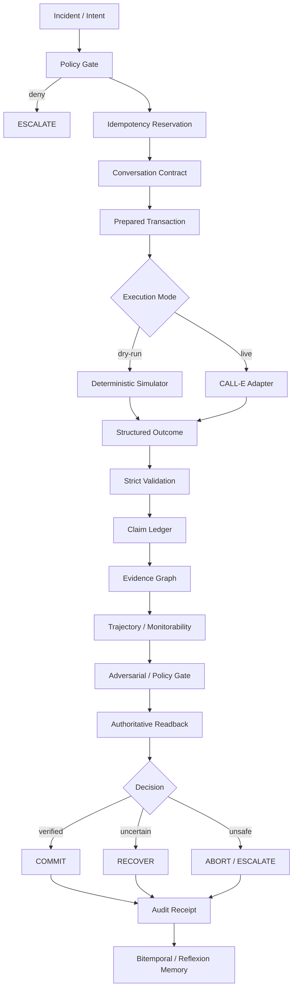

# AegisFleet — Architecture

## 1. Cel architektury

AegisFleet jest kontrolowaną warstwą wykonawczą nad CALL-E. Rozdziela:

- intencję biznesową,
- politykę i autoryzację,
- przygotowanie transakcji,
- wykonanie połączenia,
- walidację wyniku,
- dowody i stan epistemiczny,
- decyzję COMMIT / ABORT / RECOVER,
- audyt i receipt.

Zasada nadrzędna:

> **Model confidence ≠ authorization ≠ truth.**

## 2. Runtime flow



## 3. CALL-E boundary

Provider output jest traktowany jako zewnętrzny, nieautorytatywny fakt rozmowy.

```text
AegisFleet domain
       │
       ▼
executeWithCalle()
       │
       ▼
CALL-E
       │
       ▼
raw provider result
       │
       ▼
validateOutcome()
       │
       ▼
allowlisted CallOutcome
```

Provider nie może bezpośrednio wykonać biznesowego COMMIT.

## 4. Idempotency i side-effect conservation

Operacja otrzymuje stabilny klucz przed wywołaniem providera. Dzięki temu ponowne uruchomienie tej samej logicznej operacji może zostać rozpoznane bez automatycznego wykonania drugiego połączenia.

```text
reserve(operationKey)
        │
        ├── existing terminal record → reuse
        │
        └── new record → provider execution
```

Jeżeli stan zewnętrznego side effectu jest nieznany, system nie wykonuje ślepego retry.

## 5. Structured outcome

Minimalny wynik biznesowy jest ograniczony do jawnie dozwolonego kontraktu:

```typescript
interface CallOutcome {
  route_acceptance: "yes" | "no" | "unknown";
  eta_update_time: string;
  escalation_needed: "none" | "routine" | "urgent";
  evidence_summary: string;
  confidence: "high" | "medium" | "low" | "unknown";
}
```

Nieznane, dodatkowe lub źle typowane pola nie są automatycznie akceptowane jako poprawne dane operacyjne.

## 6. Evidence / epistemic layer

AegisFleet rozdziela:

```text
CLAIM
  ↓
EVIDENCE
  ↓
PROVENANCE
  ↓
EPISTEMIC STATUS
  ↓
DECISION
```

Podstawowe statusy obejmują `UNKNOWN`, `UNVERIFIED`, `CONTRADICTED` i `STALE`. Żaden z nich nie może zostać po cichu zamieniony w `verified success`.

## 7. Adversarial decision boundary

Przed COMMIT system powinien sprawdzić m.in.:

1. czy wynik spełnia wymagania polityki;
2. czy eskalacja jest jawnie `none`;
3. czy istnieje wymagane ETA i dowód;
4. czy nie ma sprzecznych twierdzeń;
5. czy stan przygotowany nie jest przestarzały;
6. czy ścieżka wykonania jest bezpieczna;
7. czy receipt może wskazać konkretny łańcuch dowodowy.

## 8. Webhook / terminal events

Webhooki są wejściem obserwacyjnym. Nie otrzymują automatycznie prawa do zmiany stanu biznesowego.

```text
CALL-E terminal event
        ↓
webhook parser
        ↓
event validation
        ↓
correlation by call_id / operation
        ↓
state observation
        ↓
transaction gate
```

## 9. Memory

Warstwa pamięci obejmuje m.in. pamięć bitemporalną i reflexion findings. Pamięć może dostarczać kontekst, ale nie może samodzielnie autoryzować konsekwencyjnej operacji.

```text
historical memory
      ↓
context / retrieval
      ↓
reasoning support
      ↓
current authoritative state
      ↓
policy decision
```

## 10. Dry-run vs live

### Dry-run

`npm run demo` nie wykonuje połączeń telefonicznych ani zewnętrznych side effects. Służy do reprodukowalnej weryfikacji logiki.

### Live

`npm run live` działa wyłącznie przy jawnej konfiguracji live i jest przeznaczony do pojedynczego kontrolowanego testu. Workflow GitHub Actions wykonuje testy i typecheck przed próbą wykonania połączenia.

## 11. Rust SNN / Zenoh

`rust/snn-zenoh` jest odseparowaną ścieżką niskiego opóźnienia. Nie omija policy, idempotency, evidence ani transaction gates.

```text
signal fast path
      ↓
Rust SNN / optional Zenoh
      ↓
bounded signal output
      ↓
AegisFleet authority boundary
```

## 12. Research capability boundary

Warstwy nazwane HDC, JEPA-style, DGM, Digital Genotype, AlphaEvolve-style, MARS, ImandraX-style, ASI/transcendence 70–99 itd. są ograniczonymi kontraktami badawczymi lub adapterami. Nie należy ich przedstawiać jako reprodukcji proprietary research systems.

Hard boundary:

```text
CAPABILITY ≠ AUTHORIZATION
PROPOSAL ≠ EXECUTION
CONFIDENCE ≠ TRUTH
RESEARCH ADAPTER ≠ PROPRIETARY SYSTEM
```

## 13. Receipt

Końcowy receipt powinien umożliwiać odtworzenie:

- identyfikatora operacji,
- decyzji,
- wyniku CALL-E,
- call ID, jeżeli istnieje,
- dowodów,
- stanu przed i po operacji,
- digestu audytowego,
- powodów RECOVER / ABORT / ESCALATE.

## 14. Production invariants

1. Brak COMMIT bez spełnienia jawnych warunków.
2. `UNKNOWN` nie oznacza `NO` ani `YES`.
3. Provider nie jest źródłem autorytetu biznesowego.
4. Retry po nieznanym side effect nie może tworzyć ślepego duplikatu.
5. Pamięć i reasoning nie mogą samodzielnie autoryzować operacji.
6. Dry-run nie może być opisywany jako realne połączenie.
7. Badawcze adaptery nie mogą być przedstawiane jako implementacje proprietary systems.
8. Każdy consequential decision musi mieć możliwy do prześledzenia receipt.
